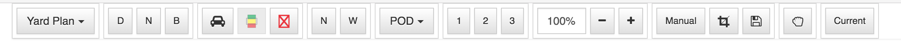

# jquery-toolbar
JQuery Toolbar, a plugin for building toolbar rapidly.



## Dependencies
This plugin are using `jquery`, `bootstrap`, `font-awesome` as belows:

```
  "dependencies": {
    "jquery": ">= 1.9.0",
    "bootstrap": ">= 3.0.0",
    "font-awesome": "fontawesome#^4.6.3"
  }
```

## Getting Started
### Install
You can install using bower (recommended):

`bower install --save git@github.com:lucduong/jquery-toolbar.git#v1.0.0`

or [Download](https://github.com/lucduong/jquery-toolbar/releases/tag/v1.0.0) manually

### Usage
Add the following resources

```
  <!-- Required Stylesheets -->
  <link href="./vendor/bootstrap/dist/css/bootstrap.min.css" rel="stylesheet">
  <link href="./vendor/bootstrap/dist/css/bootstrap-theme.min.css" rel="stylesheet">
  <link href="./vendor/font-awesome/css/font-awesome.min.css" rel="stylesheet">
  <link href="./assets/css/jquery-toolbar.css" rel="stylesheet">
  
  <!-- Required Javascript -->
  <script type="text/javascript" src="./vendor/jquery/dist/jquery.min.js"></script>
  <script type="text/javascript" src="./vendor/bootstrap/dist/js/bootstrap.min.js"></script>
  <script type="text/javascript" src="./assets/js/jquery-toolbar.js"></script>
```

The component will bind to any existing DOM element.

`<div class="toolbar"></div>`

Basic usage should be like this:

```
  var options = {data: []};
  
  var $toolbar = $('#toolbar').toolbar(options);
```

## Data Structure
I strongly recommend the data structure should be like below:

```
var options = {
    data: [
      {
        "id": "group1",
        "name": "group1",
        "childs": [
          {
            "id": "viewType",
            "name": "viewType",
            "type": "combo",
            "selectedIndex": 2,
            "options": [
              {text: "Standard", value: "1"},
              {text: "Actual", value: "2"},
              {text: "Yard Plan", value: "3"}
            ]
          }
        ]
      },
      {
        "id": "group2",
        "name": "group2",
        "childs": [
          {
            "id": "btnDedicate",
            "name": "btnBoundary",
            "text": "D",
            "type": "toggleButton",
            "styleName": "btn btn-default btn-sm"
          },
          {
            "id": "btnNomination",
            "name": "btnBoundary",
            "text": "N",
            "type": "toggleButton",
            "styleName": "btn btn-default btn-sm"
          },
          {
            "id": "btnBoundary",
            "name": "btnBoundary",
            "text": "B",
            "type": "toggleButton",
            "styleName": "btn btn-default btn-sm"
          }
        ]
      },
      {
        "id": "group3",
        "name": "group3",
        "childs": [
          {
            "id": "btnShowCargo",
            "name": "btnShowCargo",
            "type": "toggleButton",
            "useIcon": "fa fa-car fa-lg",
            "styleName": "btn btn-default btn-sm"
          },
          {
            "id": "btnDisabled",
            "name": "btnDisabled",
            "type": "toggleButton",
            "useImage": "./assets/images/bd.png",
            "imageStyle": "width: 14px;height:17px",
            "styleName": "btn btn-default btn-sm",
            "state": {
              "disabled": true
            }
          },
          {
            "id": "btnNW",
            "name": "btnNW",
            "type": "toggleButton",
            "useImage": "./assets/images/nw.png",
            "imageStyle": "width: 14px;height:17px",
            "styleName": "btn btn-default btn-sm"
          }
        ]
      },
      {
        "id": "group4",
        "name": "group4",
        "childs": [
          {
            "id": "btnShowNL",
            "name": "btnShowNL",
            "text": "N",
            "type": "toggleButton",
            "styleName": "btn btn-default btn-sm"
          },
          {
            "id": "btnShowWL",
            "name": "btnShowWL",
            "text": "W",
            "type": "toggleButton",
            "styleName": "btn btn-default btn-sm"
          }
        ]
      },
      {
        "id": "group5",
        "name": "group5",
        "childs": [
          {
            "id": "optXYZ",
            "name": "optXYZ",
            "type": "combo",
            "selectedIndex": 0,
            "options": [
              {text: "POD", value: "444"},
              {text: "Shipper", value: "445"},
              {text: "Consignee", value: "446"},
              {text: "Commodity", value: "447"},
              {text: "Maker + POD", value: "448"}
            ]
          }
        ]
      },
      {
        "id": "group6",
        "name": "group6",
        "childs": [
          {
            "id": "btnLevel1",
            "name": "btnLevel1",
            "text": "1",
            "type": "toggleButton",
            "styleName": "btn btn-default btn-sm"
          },
          {
            "id": "btnLevel2",
            "name": "btnLevel2",
            "text": "2",
            "type": "toggleButton",
            "styleName": "btn btn-default btn-sm"
          },
          {
            "id": "btnLevel3",
            "name": "btnLevel3",
            "text": "3",
            "type": "toggleButton",
            "styleName": "btn btn-default btn-sm"
          }
        ]
      },
      {
        "id": "group7",
        "name": "group7",
        "childs": [
          {
            "id": "inpZoom",
            "name": "inpZoom",
            "type": "inputText",
            "value": "100%",
            "styleName": "col-md-1 col-lg-1",
            "inlineStyle": "width: 62px"
          },
          {
            "id": "btnZoomOut",
            "name": "btnZoomOut",
            "text": "-",
            "type": "button",
            "useIcon": "fa fa-minus",
            "styleName": "btn btn-default btn-sm"
          },
          {
            "id": "btnZoomIn",
            "name": "btnZoomIn",
            "text": "+",
            "type": "button",
            "useIcon": "fa fa-plus",
            "styleName": "btn btn-default btn-sm"
          }
        ]
      },
      {
        "id": "group8",
        "name": "group8",
        "childs": [
          {
            "id": "btnManual",
            "name": "btnManual",
            "type": "toggleButton",
            "text": "Manual",
            "styleName": "btn btn-default btn-sm"
          },
          {
            "id": "btnDrag",
            "name": "btnDrag",
            "type": "toggleButton",
            "useIcon": "fa fa-crop fa-lg",
            "styleName": "btn btn-default btn-sm"
          },
          {
            "id": "btnSave",
            "name": "btnSave",
            "type": "button",
            "useIcon": "fa fa-save fa-lg",
            "styleName": "btn btn-default btn-sm"
          },
          {
            "id": "btnD1",
            "name": "XaX",
            "type": "radio",
            "value": "2",
            "useHtml": '<div class="icon icon-down-right"><i class="fa fa-long-arrow-down"></i><i class="fa fa-long-arrow-right"></i></div>'
          },
          {
            "id": "btnD2",
            "name": "XaX",
            "type": "radio",
            "value": "3",
            "useHtml": '<div class="icon icon-left-down"><i class="fa fa-long-arrow-left"></i><i class="fa fa-long-arrow-down"></i></div>'
          },
          {
            "id": "btnD3",
            "name": "XaX",
            "type": "radio",
            "value": "4",
            "useHtml": '<div class="icon icon-up-right"><i class="fa fa-long-arrow-up"></i><i class="fa fa-long-arrow-right"></i></div>'
          },
          {
            "id": "btnD4",
            "name": "XaX",
            "type": "radio",
            "value": "5",
            "useHtml": '<div class="icon icon-left-up"><i class="fa fa-long-arrow-left"></i><i class="fa fa-long-arrow-up"></i></div>'
          }
        ]
      },
      {
        "id": "group9",
        "name": "group9",
        "childs": [
          {
            "id": "btnMove",
            "name": "btnMove",
            "text": "M",
            "type": "toggleButton",
            "useIcon": "fa fa-hand-rock-o fa-lg",
            "styleName": "btn btn-default btn-sm"
          }
        ]
      },
      {
        "id": "group9",
        "name": "group9",
        "childs": [
          {
            "id": "btnCurrent",
            "name": "btnCurrent",
            "type": "button",
            "text": "Current",
            "styleName": "btn btn-default btn-sm"
          }
        ]
      }
    ]
  };
```

## Methods
The following is a list of all available methods.
**getState(id)**
Get the state of item by Id

`$('#toolbar').toolbar('getState', id)`

**getSelectedItem(id)**
Get selected item by Id

`$('#toolbar').toolbar('getState', id);`

**getItemValue(id)**
Get value of item by Id

`$('#toolbar').toolbar('getItemValue', id);`

## Events
You can bind to any event defined below by either using an options callback handler, or the standard jQuery .on method.

Example using options callback handler

```
var options = {
    data: [],
    onDropDownSelected: onDropDownSelected,
    onButtonToggled: onButtonToggled
  };
```

In your application

```
function onDropDownSelected(event, item) {
  // Do anything here
}

...
```

### List of Events

`onDropDownSelected(event, item)` - When selected an item in dropdown list

`onButtonToggled(event, item)` - When toggled the button

`onButtonClick(event, item)` - When normal button click

`onItemSelected(event, item)` - When selected radio or checkbox

## License
The plugin release under MIT License

The MIT License (MIT)

Copyright (c) 2016 Duong Tuan Luc

Permission is hereby granted, free of charge, to any person obtaining a copy
of this software and associated documentation files (the "Software"), to deal
in the Software without restriction, including without limitation the rights
to use, copy, modify, merge, publish, distribute, sublicense, and/or sell
copies of the Software, and to permit persons to whom the Software is
furnished to do so, subject to the following conditions:

The above copyright notice and this permission notice shall be included in all
copies or substantial portions of the Software.

THE SOFTWARE IS PROVIDED "AS IS", WITHOUT WARRANTY OF ANY KIND, EXPRESS OR
IMPLIED, INCLUDING BUT NOT LIMITED TO THE WARRANTIES OF MERCHANTABILITY,
FITNESS FOR A PARTICULAR PURPOSE AND NONINFRINGEMENT. IN NO EVENT SHALL THE
AUTHORS OR COPYRIGHT HOLDERS BE LIABLE FOR ANY CLAIM, DAMAGES OR OTHER
LIABILITY, WHETHER IN AN ACTION OF CONTRACT, TORT OR OTHERWISE, ARISING FROM,
OUT OF OR IN CONNECTION WITH THE SOFTWARE OR THE USE OR OTHER DEALINGS IN THE
SOFTWARE.